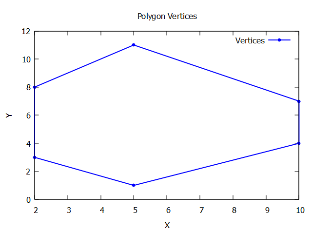

# Concepts of C++ for this project!

## Object Oriented Programming - C++ Class
A C++ class is a blueprint for creating objects. It encapsulates data for the object and methods to manipulate that data. Classes define the properties (data members) and behaviors (member functions or methods) that the objects created from the class can have.

## C++ vector 

Vector is the part of C++ Standard Template Library. They are used to store the elements dynamically. Vectors are STL containers that have a special feature to increase or decrease the size considering the requirement of insertion and deletion inside a program.

In the case of a static array, we cannot insert elements once it is full but when the size of a vector becomes full then it doubles its size from the original. That's why it is beneficial to use a vector instead of a static array.
 
In C++, a vector is similar to dynamic arrays with the ability to resize itself automatically. Vector elements are stored in contiguous memory locations so that they can be accessed and traversed using iterators.

Some of the functions associated with a vector:

begin(): Returns an iterator pointing to the first element in the vector.    
end(): Returns an iterator pointing to the theoretical element that follows the last element in the vector.    
rbegin(): Returns a reverse iterator pointing to the last element in the vector (reverse beginning). It moves from last to first element.   
size(): Returns the number of elements in the vector.  
empty(): Returns whether the vector is empty.    
push_back(): It pushes the elements into a vector from the back.    
pop_back(): It is used to pop or remove elements from a vector from the back.    
insert(): It inserts new elements before the element at the specified position.   


vectorname.push_back(value) is the same as append in python.  
C++ push_back() is a pre-defined function that is used to insert data or elements at the end of the vector or it pushes the element in the vector from the back. The method is declared inside the <vector> and <bits/stdc++.h> header files.

###  Constructors in C++ 
Constructor is a member function of a class, whose name is the same as the class name.  
Constructor is a special type of member function that is used to initialize the data members for an object of a class automatically when an object of the same class is created.  
Constructor is invoked at the time of object creation. It constructs the values i.e. provides data for the object that is why it is known as a constructor.  
Constructors do not return value, hence they do not have a return type.  
A constructor gets called automatically when we create the object of the class.  

Parameterized Constructors make it possible to pass arguments to constructors. Typically, these arguments help initialize an object when it is created. To create a parameterized constructor, simply add parameters to it the way you would to any other function. When you define the constructor’s body, use the parameters to initialize the object.  

The selected code snippet appears to be a constructor implementation for a class called Cell. Constructors are special member functions in C++ that are used to initialize objects of a class. They are typically called when an object is created.

In this case, the constructor takes a single parameter, which is a constant reference to a std::vector of Vertices objects. The std::vector is a container class in C++ that allows you to store and manipulate a dynamic array of elements.

The constructor initializes the member variable nodes of the Cell class with the value passed as the parameter. The nodes member variable is likely declared somewhere in the class definition.

The use of the initializer list : nodes(nodes) is a shorthand way of initializing the nodes member variable with the value passed as the parameter. It is a best practice to use initializer lists in constructors to initialize member variables, as it can improve performance and avoid unnecessary object copying.

Overall, this constructor allows you to create a Cell object by providing a std::vector of Vertices objects, and it initializes the nodes member variable with the provided value.

### Code to compute the area and perimeter of a single vertex model

```cpp
#include <iostream>
#include <vector>
#include <cmath>

using namespace std;

class Vertices{
    public:
    // for a 2D cell (x,y) are the vertex coordinates
    // these are members of the class
    double x;
    double y;

    // constructor to initialize the vertices
    Vertices(double x1, double y1)
    {
    x = x1;
    y = y1;
    }

};

class Cell{
    public:
    // nodes is a vector of vertices
    vector<Vertices>nodes;

    // Shoelace's formula to calculate the area of the cell
    double get_Area(){
        // initialise area
        double area = 0;
        // loop through the vertices
        for (int i = 0; i < nodes.size(); i ++){
            // area calculated using the Shoelace formula
            area += nodes[i].x * nodes[(i+1) % nodes.size()].y - nodes[(i+1) % nodes.size()].x * nodes[i].y;
        }
        // area = abs(area) / 2;
        // although it is intuitive to think area as positive, here this is not the case
        area = area / 2;
        return area;
    }

    double get_Perimeter(){
        // initialise perimeter
        double perimeter = 0;
        // loop through the vertices
        for (int i = 0; i < nodes.size(); i++){
            // find distance between vertices
            double distance = sqrt(pow(nodes[i].x - nodes[(i+1) % nodes.size()].x, 2) + pow(nodes[i].y - nodes[(i+1) % nodes.size()].y, 2));
            // add distance to perimeter
            perimeter += distance;         
        }
        return perimeter;
    }
};
// main function will create an object of the class Cell and calculate the area and perimeter
int main(){
    // declare an object of the class Cell
    Cell C;
    // assign vertices to the object
    C.nodes = { {10, 7}, {5, 11}, {2, 8}, {2, 3},{5, 1}, {10, 4}};
    // calculate the area
    double area = C.get_Area();
    // calculate the perimeter
    double perimeter = C.get_Perimeter();
    // print the area and perimeter
    cout << "Area of the cell is: " << area << endl;
    cout << "Perimeter of the cell is: " << perimeter << endl;
    return 0;

}
```

## C++ array
Suppose you want to store multiple values like "orange", "apple", "watermelon" to a single variable say "fruit". Then instead of declaring each of them separately as "fruit1", "fruit2", "fruit3" , we can make use of arrays.
Arrays are used to store multiple values to a single variable, instead of declaring separate variable for each value.

```cpp
string fruits[3] = {"orange", "apple", "watermelon"};
\\ here 3 is the number of elements in the array
```

Access an element of array by referring to index number 
```cpp
cout << fruits[1];
\\ Output: apple
```

An element can be replaced using the index number too
```cpp
fruits[1] = "guava";
cout << fruits[1];
\\ Output: guava
```

## Cell arrays
<video width="640" controls><src="my_video.mp4" type="video/mp4"></video>
<video controls src="my_video.mp4" title="Title"></video>
## C++ pointers and &

address (&) assigns the address of the variable to another and pointer (*) assigns the value of the variable to another.
``` cpp
   var = 3000;
   // take the address of var
   ptr = &var;
   // take the value available at ptr
   val = *ptr;
```

https://www.freecodecamp.org/news/cpp-vector-how-to-initialize-a-vector-in-a-constructor/